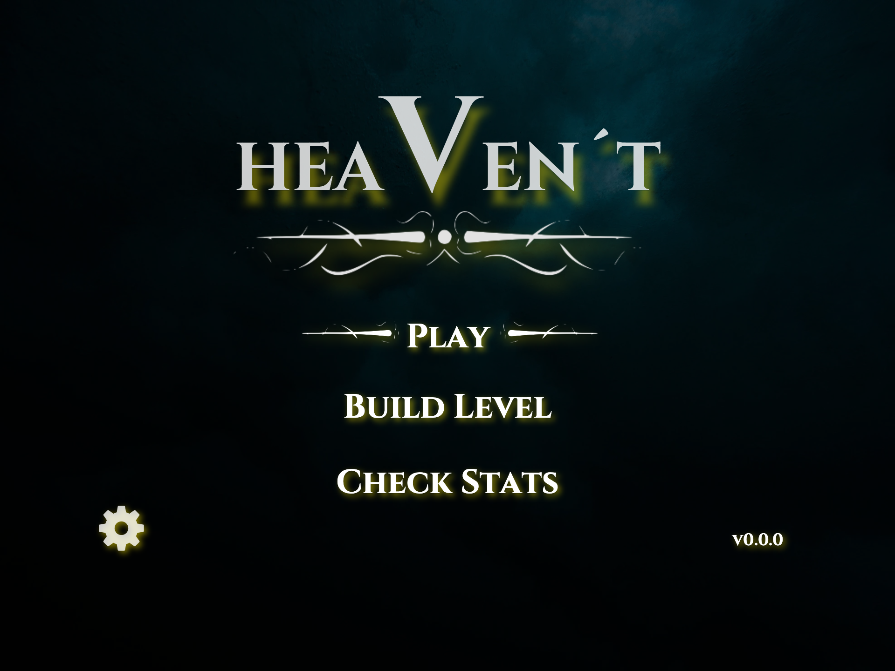
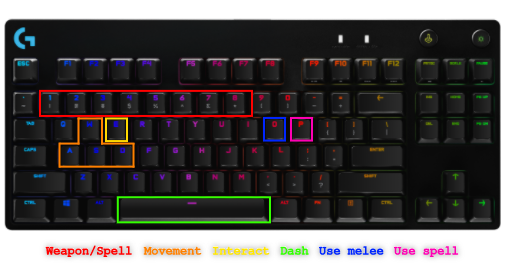
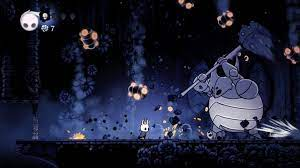
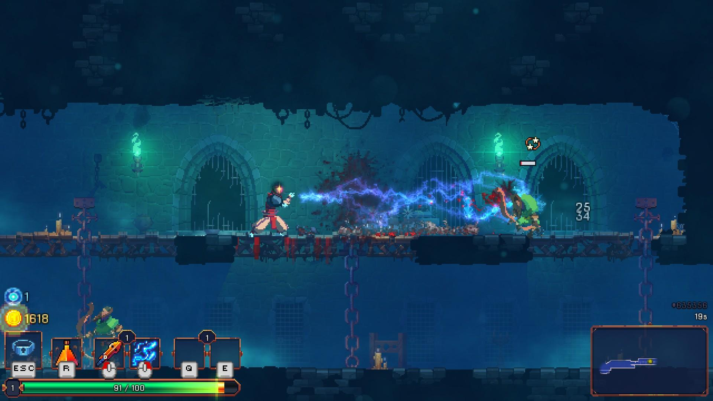
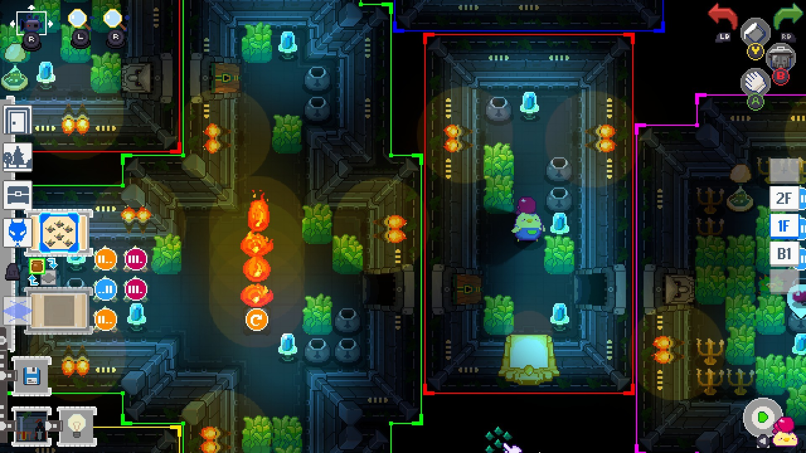
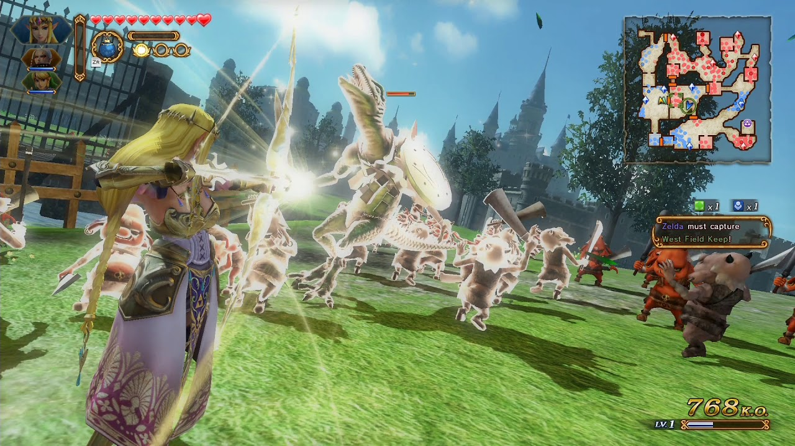
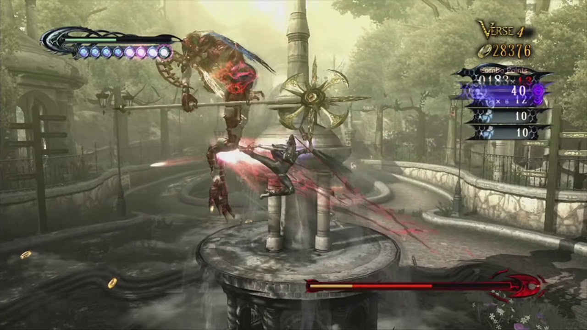

# **Heaven't**

## _Game Design Document_

---

### Authors:
##### Emiliano Cabrera Ruiz - A01025453 Andrew Dunkerley Vera - A01025076 Do Hyun Nam - A01025276 Diego Corrales Pinedo - A01781631  TC2005B - Group 500  April 4th, 2022

---

## _Index_

---

- [**Heaven't**](#heavent)
  - [_Game Design Document_](#game-design-document)
    - [Authors:](#authors)
        - [Emiliano Cabrera Ruiz - A01025453 Andrew Dunkerley Vera - A01025076 Do Hyun Nam - A01025276 Diego Corrales Pinedo - A01781631  TC2005B - Group 500  April 4th, 2022](#emiliano-cabrera-ruiz---a01025453andrew-dunkerley-vera---a01025076do-hyun-nam---a01025276diego-corrales-pinedo---a01781631tc2005b---group-500april-4th-2022)
  - [_Index_](#index)
  - [_Game Design_](#game-design)
    - [**Summary**](#summary)
    - [**Gameplay**](#gameplay)
    - [**Mindset**](#mindset)
  - [_Technical_](#technical)
    - [**Screens**](#screens)
    - [**Controls**](#controls)
        - [Creating a level](#creating-a-level)
        - [Playing the game](#playing-the-game)
    - [**Mechanics**](#mechanics)
  - [_Level Design_](#level-design)
    - [**Themes**](#themes)
    - [**Game Flow**](#game-flow)
      - [Level Creation](#level-creation)
      - [Playing a level](#playing-a-level)
  - [_Development_](#development)
    - [**Abstract Classes / Components**](#abstract-classes--components)
    - [**Derived Classes / Component Compositions**](#derived-classes--component-compositions)
  - [_Graphics_](#graphics)
    - [**Style Attributes**](#style-attributes)
    - [**Graphics Needed**](#graphics-needed)
  - [_Sounds/Music_](#soundsmusic)
    - [**Style Attributes**](#style-attributes-1)
    - [**Sounds Needed**](#sounds-needed)
    - [**Music Needed**](#music-needed)
  - [_Schedule_](#schedule)

## _Game Design_

---

### **Summary**

***Heaven't*** is a _Hack and Slash_ dungeon crawler that focuses on player interaction by allowing it's users to create their own levels!

### **Gameplay**

The gameplay itself is quite simple. The main goal of the game is to beat a level by killing all boss-type monsters within it, all the while exploring the level and fighting hordes of smaller, but still deadly, enemies! The player may encounter several items such as weapons, spells, and health to aid them on their mission to exterminate bosses, however, it is entirely up to them to decide whether they'd like to use them or not. Whatever they may choose, it will be a testament of their capability to juggle large hordes of enemies and high-speed movement and combat. 

### **Mindset**

The feeling that we want our players to experience is that of a power-high, but we also wish to challenge their skills with said power. The amount of tools on the player's kit can become very wide and at times it may seem overpowered; however, we believe all of these tools are necessary if they are to tackle difficult challenges that are created by players, be it themselves or others!

## _Technical_

---

### **Screens**

1. Title Screen
    1. Play
    2. Build Level
    3. Check Stats
2. Play
3. Choose level
4. Build Level
5. Check Stats
6. Game
7. End Credits

### **Controls**

##### Creating a level
Controls for creating a level are simple as they only utilize the mouse in conjunction with the on-screen menus. Placing or selecting individual elements would be done with left-click, whereas selecting several of them would be done via dragging a selected area with right-click.

##### Playing the game
The controls are fairly simple: one button to use the equiped melee weapon, another for the equiped spell, these will be bound to 'O' and 'P', respectively and we'll bind the dash to the spacebar. Aside from those, the player will have one button for interaction, 'E', with which the player can pick up items and open doors. The last few buttons will allow the player to switch between their 8 posible slots of spells and items; these are going to be bound to the numbers on the keyboard. Movement will be done through the classic W-A-S-D input system.

### **Mechanics**

_Level Creation_ is the main focus of the game. Due to this, we've decided to streamline the process the player will go through in order to make one, which means that the approach we've taken relies on a grid and preset tiles and entities. However, this does not mean that they're limited in what they can do, as players will not only be capable of placing tiles to make their rooms and entities to fill them, but they will be able to modify certain values in the entities that they add. They can change the attack speed and damage on weapons, so as to make an ultra greatsword that swings as fast as a foam sword, but also hits like one; or they may modify movement speed and health on enemies, so they can make other players experience the terror of having a boss-monster running towards them at the speed of sound while it being nigh unkillable.

Since enemy encounters in the game are primarily comprised of swarms or large groups of them, their _behaviour_ prioritizes following the player and attacking them when they are in range. Melee-type enemies and bosses will aim to get close to the player and attack them, doing so until either the player or the enemy in question has died. Enemies with ranged attacks will follow a similar pattern, however they will prefer to remain at a medium-to-long range from the player in order to hit them. 

One of the most interesting and important mechanics within our game is _stagger_. It functions as both a knockback and stun mechanic with which the player will be able to create some breathing room when being swarmed by dozens of enemies on a single screen. The main idea is that when an enemy is attacked with a melee weapon they are pushed away from the player and their ongoing attacks are interrupted, and its effectiveness is dependent on the weapon and the enemy types, as certain weaponry hits 'harder' than others, such as a mace, and some enemies get staggered less in order to make them a more prevalent threat. 

Since it is a _Hack and Slash_, we would hate for players to feel either slow or stuck, so we also decided to add a _dash_ mechanic with which they will be able to accelerate once in a given direction. This will alow players to quickly pass through enemy hordes as well as being invulnerable to damage for a brief period of time. This dash mechanic does have a short cooldown after its use, in order to incentivize players to use it as effectively as possible, but it can be completely recharged if the player hits an enemy with a melee weapon after doing the dash. This last characteristic makes recharging one's dash into a risk-reward scenario, as having your dash up allows you to avoid enemies when necessary and it makes combat fast-paced, however doing so makes you vulnerable to being hit.

Another important mechanic within the game is _health_. Health Points (HP) are the metric by which we determine the player's capability to take damage, since if they reach 0 they will immediately lose the level. These points are lost when the player gets hit by enemies, but can be regained with _healing_ in the form of health drops from enemies.

_Game Over_ can be achieved in one of two ways: you either lose all your HP and fail, or you defeat all bosses in the level and win. Whatever may be in the middle is completely up to the creator, as it functions to give players the challenge of a full dungeon-esque structure, or to build them up to the task of defeating the bosses via weaponry.

Lastly, spells are this game's form of projectile weaponry. It is to be noted that they do require ammunition in the form of _Faith_, a meter, similar to the HP one, that determines how many times spells can be fired before needing to recharge. Some spells require more Faith Points (FP) to use than others, so one's FP will be drained quickly when using them. FP is recovered in only one way: by striking enemies with melee weapons, which requires the player to get close to the enemies and risk getting hit.

As mentioned across several of the mechanics, _variable customization_ will be possible for all entities' in the game. A player will be able to place entities; the term 'entities' refers to enemies, weapons, spells, and spawners; which they will be able to modify to a certain degree. This is to say that certain attributes wil be modifiable. 
Enemies and spawners will have the following modifiable attributes:
1. Health
2. Movement speed
3. Damage
4. Stagger multiplier
 All enemies spawned by a spawner will have the selected modified attributes.

Weapons will have the following modifiable attributes:
1. Damage
2. Attack speed
3. Size
4. Stagger multiplier
5. FP return

Spells wil have the following modifiable attributes:
1. Damage
2. Casting speed
3. FP cost

## _Level Design_

---

### **Themes**

1. Heaven
    1. Mood
        1. Bright, soothing yet intense, divine
    2. Objects
        1. _Ambient_
            1. Clouds
            2. Rays of sunlight
            3. Doves
        2. _Interactive_
            1. Weaponry
            2. Spells
            3. Drops
2. Hell
    1. Mood
        1. Dark and red-ish in hue, ominous, anxiety-inducing
    2. Objects
        1. _Ambient_
            1. Smoke
            2. Fire
            3. Blood
        2. _Interactive_
            1. Weaponry
            2. Spells
            3. Drops
3. Purgatory
   1. Mood
      1. Silent, void, unsettling
   2. Objects
      1. _Ambient_
         1. Static
         2. Blue flames
         3. Mist
      2. _Interactive_
         1. Weaponry
         2. Spells
         3. Drops

The ethereal and somber atmosphere

The strikingly vibrant contrast and colors

### **Game Flow**

#### Level Creation

1. Player enters a blank level, the only thing present are the tile and entity menus, as well as the background and a small platform that has the _starting point_ on it
2. They can choose and place tiles and entities to their liking
3. They can modifiy values on entities to their liking
4. They can play the level at any point in order to verify it works as they want, there **must** be a starting point present in order for them to play it
5. They finish building the level and can decide to either just save it or to upload it as well
6. If they decide to upload it, they must play the level and pass it in order for it to be greenlit

Super Dungeon Maker, available on Steam

#### Playing a level

1. Player starts within the designated starting point
2. They fight across the level
3. They may pick up weaponry and spells if there are any available
4. They finish the level in one of two ways: they deplete their HP and lose, or they kill all boss-type monsters and win.

## _Development_

---

### **Abstract Classes / Components**

1. BasePhysics
    1. BasePlayer
    2. BaseEnemy
    3. BaseObject
2. BaseObstacle
3. BaseInteractable

### **Derived Classes / Component Compositions**

1. BasePlayer
    1. PlayerMain
    2. PlayerUnlockable
2. BaseMob
    1. NormalMob
    2. RangedMob
    3. NoStagMob (doesn't have knockback)
    4. BossMob
3. BaseCollider
    1. WallCollider (sprites depend on decorators)
    2. DoorCollider (opens and closes)
4. BaseCollectible
    1. CoinCollectible
    2. LifeCollectible
5. BaseEventActivator
    1. Spawner
    2. StartingPoint
    3. HeavensGate
6. Decorators (do not have a functional role)
    1. Blood
    2. Pigeons
    3. Ghosts
    4. Pilars

## _Graphics_

---

### **Style Attributes**

The use of color will depend on the themes the player decides to put into their levels. We opted to go for more vibrant and ethereal colors for the Heaven theme, as to give it that bright and intense aura, using primarily blues, whites, and yellows; and for the Hell theme we opted for more opaque and dark colors, adhering to a more red, purple, and grey palette.

We pondered what type of style we'd like to give the game, and felt at home with the idea of a pixel-based world. It made the theme of a not-so angelic Angel mesh with combat in a way that was remniscent of more iconic dungeon-crawlers and hack-and-slash games. It was also the most simple way to implement good looking graphics as well as a level of detail that felt appropriate with a 'build-a-game'-type game

Since ***Heaven't*** is supposed to have fast-paced combat across most of a playthrough, indicators of damage and healing will be quick. Something akin to a red flash around the screen when sustaining damage, or a yellow or green border when picking up health, this alongside particle effects that activate when the corresponding event takes place: red droplets or a yellow aura around the player.

Item and drop interaction will most likely happen once combat is over, as it is risky to stop and ponder if swapping an item is worth it when being chased by 15 enemies of varying speeds, sizes, and power. The indication will hover above the player's character whenever they are in range of a dropped weapon or spell, indicating the pickup button and the item on the ground.

### **Graphics Needed**

1. Characters
    1. Protagonist (idle, walking, melee, spell-casting)
    2. Enemies
       1. Normal
           1. Angel (idle, walking, melee, stagger)
           2. Demon (idle, walking, melee, stagger)
           3. Specters (idle, walking, shooting, stagger)
        1. Boss
           1. Biblically-accurate Angel (idle, walking, melee, shooting)
2. Blocks
    1. Heaven Floor
    2. Hell Floor
    3. Purgatory Floor
    4. Heaven Wall
    5. Hell Wall
    6. Purgatory Wall
    7. Door
3. Ambient
    1. Blood
    2. Doves
    3. Ghosts
    4. Drops
       1. Weapons
          1. Sword
          2. Greatsword
          3. Spear
          4. Mace
          5. Dagger
          6. Whip
       2. Spells
          1. Fire
          2. Ice
          3. Lightning
          4. Greater Fire
          5. Greater Ice
          6. Greater Lightning
       3. Health 
4. Other
    1. Weapons
       1. Sword (idle, attacking)
       2. Greatsword (idle, attacking)
       3. Spear (idle, attacking)
       4. Mace (idle, attacking)
       5. Dagger (idle, attacking)
       6. Whip (idle, attacking)
    2. Spells
       1. Fire (idle, casting, shooting)
       2. Ice (idle, casting, shooting)
       3. Lightning (idle, casting, shooting)
       4. Greater Fire (idle, casting, shooting)
       5. Greater Ice (idle, casting, shooting)
       6. Greater Lightning (idle, casting, shooting)

Hyrule Warriors

Bayonetta

## _Sounds/Music_

---

### **Style Attributes**

For ***Heavent's*** music, the main characteristic we're looking for is that it's 8-bit style. As for specifics, it depends on what area the track is for: Heaven needs to be divine and pure so music that feels ethereal with an abundance of soft notes would be ideal, something akin to classical. Hell is much more dark and grimy, so overwhelming tunes, such as rock or metal would be good. Purgatory is based around suspensefeul terror and an unsettling atmosphere, so instead of utilizing music per-se, we thought that arranging a combination of sounds to induce a state of fight-ot-flight would be fitting. For this last point we took heavy inspiration from EAS alarms.

Sound effects are very important in order to bring out the game's nature. Fast-paced combat would need sound effects to be concise but evident, that is to say, no constant beeping or loud distraction. Most sounds would depend on enemy type both to make it varied and to: angels would play light sounds alongside a dust-like effect. Demons would perhaps be more dry sounds with some fleshy after effects. Specters would be an almost inaudible wind blowing, as if to simulate their incorporeal nature.

Weapon swings also require their own sounds, since several weapons simulate different types of metallic movement, these being cutting, thrusting, or simply flat impact. Spells are in the same boat, but these can be effects of a crackling fire for fire spells, frosting water for ice spells, and thunder for lightning spells as well as bass-boosted versions for their greater versions.

### **Sounds Needed**

1. Effects
    1. Angel footsteps 
    2. Demon footsteps 
    3. Spectre floating
    4. Sword slashing
    5. Mace impact
    6. Spear thrusting
    7. Fire spell
    8. Ice spell
    9. Lightning spell
    10. Fire spell (Greater)
    11. Ice spell (Greater)
    12. Lightning spell (Greater)
    13. Enemy projectile
    14. Enemy melee
    15. Boss footsteps
    16. Dash
2. Feedback
    1. Health pickup 
    2. Player damaged
    3. Faith recovery
    4. Angel damaged
    5. Demon damaged
    6. Spectre damaged
    7. Enemy defeated
    8. Boss defeated
    9. Death
    10. Victory
3. Building
   1. Placing floor
   2. Placing wall
   3. Removing tile
   4. Placing Angel
   5. Placing Demon
   6. Placing Spectre
   7. Placing boss
   8. Removing enemy
   9. Placing Starting point
   10. Play
   11. Return to building
   12. Save
   13. Exit

### **Music Needed**

1. Menu music track
2. Heaven theme track
3. Hell theme track
4. Purgatory theme track
5. Builder theme

[Intro Music](./assets/dd.mp3) 
[Gameplay music](./assets/lo8b.mp3)

## _Schedule_

---

_(define the main activities and the expected dates when they should be finished. This is only a reference, and can change as the project is developed)_

1. develop base classes
    1. base entity
        1. base player
        2. base enemy
        3. base block
  2. base app state
        1. game world
        2. menu world
2. develop player and basic block classes
    1. physics / collisions
3. find some smooth controls/physics
4. develop other derived classes
    1. blocks
        1. moving
        2. falling
        3. breaking
        4. cloud
    2. enemies
        1. soldier
        2. rat
        3. etc.
5. design levels
    1. introduce motion/jumping
    2. introduce throwing
    3. mind the pacing, let the player play between lessons
6. design sounds
7. design music

_(example)_